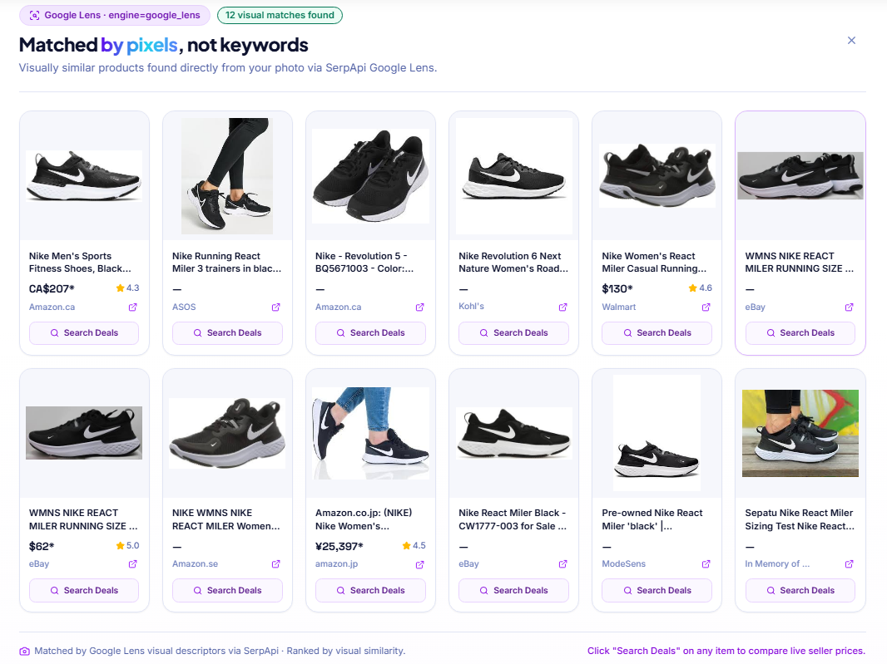
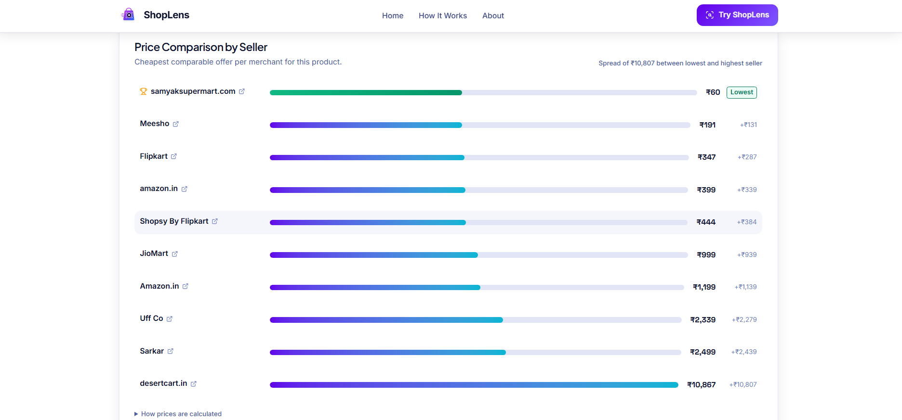
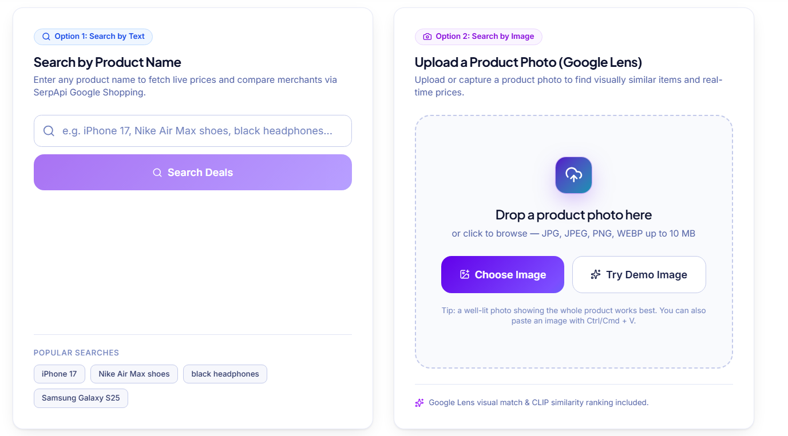
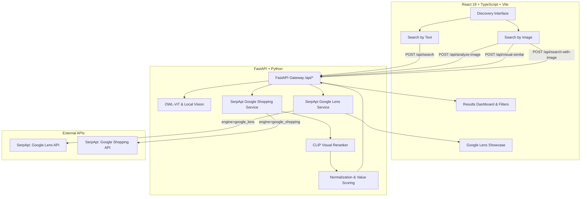

<div align="center">

# ShopLens

### See it. Search it. Buy with confidence.

Turn any product photo or keyword into real-time shopping listings, Google Lens visual matches, and an explainable price comparison — powered by SerpApi.

[](https://react.dev/)
[](https://www.typescriptlang.org/)
[](https://fastapi.tiangolo.com/)
[](https://serpapi.com/)
[](https://vite.dev/)
[](https://tailwindcss.com/)

**Built for the SerpApi India Hackathon 2026**

</div>

---

## 📸 Screenshots & Video Demo

### 🎥 Video Demonstration
> **Watch the full walkthrough & workflow demo**:  
> [](https://youtu.be/your-demo-video-link)  
> *(Replace the link above with your hosted video or YouTube/Loom demonstration)*

---

### 🖼️ Screenshots

| 1. Hero & Dual Discovery Options | 2. Upload & Google Lens Visual Matches |
| :---: | :---: |
|  |  |
| *Direct text query chips + Drag & Drop photo uploader* | *Pixel-level matches via SerpApi Google Lens* |

| 3. Live Price Comparison & Best Deal | 4. Search Product |
| :---: | :---: |
|  |  |
| *Automated Best Deal badge with transparent value scoring* | *Indian merchants (Amazon, Flipkart, etc.) in ₹ INR* |

---

## Overview

**ShopLens** solves the frustration of visual product discovery. When you spot a product in a video, store window, advertisement, or social post without knowing the exact brand or model, ShopLens bridges the gap from visual inspiration to confident purchase.

The application delivers **two independent discovery flows**:
1. **Search by Text**: Direct keyword lookup across Google Shopping via SerpApi, normalized across Indian merchants with price comparisons in INR (`₹`), ratings, and value scoring.
2. **Search by Image**: Upload or capture a product photo. Local vision models (OWL-ViT / CLIP) detect attributes and product titles, while SerpApi Google Lens (`engine=google_lens&type=visual_matches`) finds pixel-identical items, followed by CLIP cosine similarity visual reranking.

---

## Key Features

### 1. Dual Independent Product Discovery Flows
- **Search by Text**: Enter any brand, model, or product name directly. Instant search chips for popular Indian queries (e.g. *Nike Air Max 270*, *iPhone 17*, *Sony WH-1000XM5*).
- **Search by Image**: Drag-and-drop, file picker, or one-click demo sneaker. Automatic vision analysis and Google Lens query extraction.

### 2. Live SerpApi Integration
- **Google Shopping (`engine=google_shopping`)**: Live price listings from Amazon India, Flipkart, Myntra, Tata CLiQ, and brand stores (`gl=in`, `hl=en`, `location=India`).
- **Google Lens (`engine=google_lens&type=visual_matches`)**: Image uploaded to SerpApi Image API (`/image`) to obtain an `image_id`, then queried via Google Lens to retrieve pixel-similar products with live merchant prices, thumbnails, and links.
- **Resilient Fallback**: If Google Shopping returns 0 results or encounters rate limits, the backend automatically supplements with Google Lens visual matches so users always receive purchasable products.

### 3. Multi-Model Vision Pipeline
- **OWL-ViT (Zero-Shot Object Detection)**: Analyzes uploaded photos, identifies product categories, colors, materials, and generates precise, editable search queries.
- **CLIP Visual Reranking**: Compares candidate product thumbnails against the uploaded photo using cosine similarity to rank visually identical products at the top.
- **Graceful Degradation**: If local vision models are unavailable or unconfident, the user can edit suggested queries or search Google Lens directly without dead ends.

### 4. Modern UI & Aesthetics
- **Curated Palette**: Midnight Navy foundation, Electric Violet brand gradients, and Emerald deal badges.
- **Full-Width Visual Matches Showcase**: Google Lens results displayed in a spacious, responsive 6-column grid with live store badges, ratings, and one-click "Search Deals" buttons.
- **Animated Radar Scanning Loader**: Dedicated spinner and scanning animation with stage-by-stage progress feedback during image recognition and SerpApi querying.
- **Explainable Value Scoring**: Transparent scoring (55% price, 30% rating, 15% review volume) highlighting the "Best Deal" with calculated savings.

---

## Architecture



---

## API Reference

All endpoints are hosted under `/api`. Standard responses return normalized schemas, and errors follow `{ "error": { "code": "...", "message": "..." } }`.

| Method | Endpoint | Input | Description |
| --- | --- | --- | --- |
| `GET` | `/api/health` | — | Service health and provider configuration status. |
| `GET` | `/api/config` | — | Runtime configuration for frontend upload limits. |
| `POST` | `/api/analyze-image` | Multipart `file` | Detects product attributes and suggests an editable query via OWL-ViT. |
| `POST` | `/api/visual-similar` | Multipart `file` | Queries SerpApi Google Lens (`type=visual_matches`) for visual matches. |
| `GET` | `/api/visual-similar` | `?url=...` | Returns Google Lens visual matches for a public image URL. |
| `POST` | `/api/search` | `{"query": "...", "limit": 40}` | Fetches, normalizes, and compares Google Shopping results. |
| `POST` | `/api/search-with-image` | Multipart `file`, `query` | Executes image-guided search with Google Lens fallback & CLIP reranking. |

---

## Local Setup

### Prerequisites
- **Node.js 18+** and **npm**
- **Python 3.10+**
- A [SerpApi API Key](https://serpapi.com/manage-api-key) for live shopping and Google Lens results.

### 1. Clone Repository & Setup Environment
```bash
git clone https://github.com/JaivPatel07/ShopLens.git
cd ShopLens
```

Create configuration files:
```powershell
# Windows PowerShell
Copy-Item backend\.env.example backend\.env
Copy-Item frontend\.env.example frontend\.env
```
*(On Linux/macOS, use `cp backend/.env.example backend/.env`)*

Configure your `backend/.env`:
```ini
SERPAPI_API_KEY=your_serpapi_key_here
SERPAPI_LOCATION=India
SERPAPI_GL=in
SERPAPI_HL=en
VISION_PROVIDER=local
```

### 2. Start the Backend
```bash
# Create and activate virtual environment
python -m venv .venv

# Windows:
.venv\Scripts\activate
# Linux/macOS:
# source .venv/bin/activate

# Install dependencies
pip install -r backend/requirements.txt

# Start backend server
cd backend
uvicorn app.main:app --reload --port 8000
```
Backend API will be live at `http://127.0.0.1:8000` (Interactive docs at `http://127.0.0.1:8000/docs`).

### 3. Start the Frontend
In a new terminal:
```bash
cd frontend
npm install
npm run dev
```
Frontend web app will be live at `http://localhost:5173`.

---

## Running Verification & Tests

### Backend Tests (pytest)
```bash
pytest backend/tests
```
Runs the comprehensive test suite covering SerpApi Google Lens integration, shopping search, error fallbacks, and vision providers (99 passing tests).

### Frontend Build & Tests
```bash
cd frontend
npm test -- --run
npm run build
```
Validates TypeScript types, runs 62 test cases, and generates the optimized production build with 0 errors.

---

## Tech Stack Summary

| Layer | Technologies |
| --- | --- |
| **Frontend** | React 19, TypeScript 5.9, Vite 8, TailwindCSS 4, Lucide React, React Router 7 |
| **Backend** | Python, FastAPI, Pydantic v2, Uvicorn, HTTPX, Truststore |
| **Vision & AI** | OWL-ViT (Zero-Shot Detection), Hugging Face Transformers, PyTorch, PIL |
| **Data & APIs** | SerpApi (Google Shopping API, Google Lens API) |
| **Design** | Plus Jakarta Sans, Inter, Space Grotesk, Custom HSL Themes & Glassmorphism |

---

<div align="center">

**See it. Search it. Buy with confidence.**  
*Crafted for the SerpApi India Hackathon 2026*

</div>
