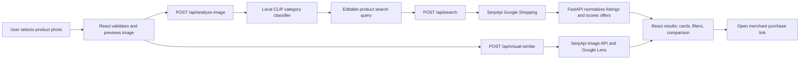
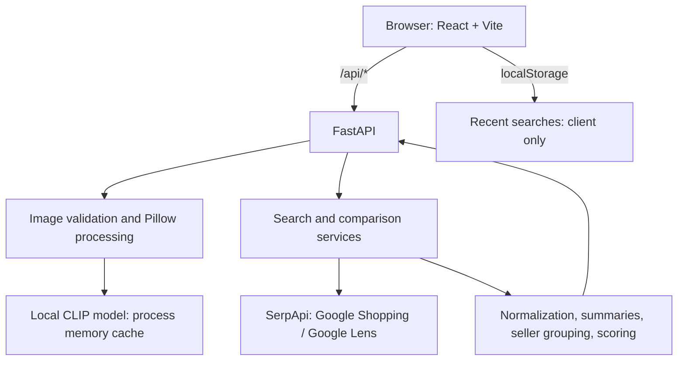

<div align="center">

# SnapBuy

### Snap it. Compare it. Buy smarter.

Turn a product photo into a searchable product query, live shopping listings, and a clear price comparison.

[](https://react.dev/)
[](https://www.typescriptlang.org/)
[](https://fastapi.tiangolo.com/)
[](https://serpapi.com/)
[](https://vite.dev/)

</div>

## Preview

> **Screenshot pending.** No application screenshots are currently committed to this repository. Add one at `docs/screenshots/home.png`, then replace this note with ``.

SnapBuy helps when you see something in a video, shop window, advert, or social post but do not know what to search for. Upload a photo, review the generated search query, compare current shopping listings, and open the merchant listing that suits you.

## The problem

Visual product discovery is frustrating when a product name, brand, or model is unknown. A manual search often means guessing keywords, opening several stores, and comparing incomplete price and seller information by hand.

## The solution

SnapBuy combines image analysis with structured shopping search:

1. A user uploads a JPG, PNG, or WEBP image.
2. A configured vision provider identifies the product and proposes an editable search query.
3. SerpApi retrieves Google Shopping listings for that query.
4. The backend normalizes inconsistent listing fields, calculates price statistics, and makes an explainable recommendation.
5. The React interface displays listings, seller offers, visual matches, filters, and direct merchant links.

## Features

### Available now

- Image upload by click, drag-and-drop, or paste, with client and server validation.
- Image preview, replacement, and removal before search.
- Free local CLIP image classification that produces an explicitly estimated, editable product category query.
- Optional OpenAI- or Gemini-compatible vision providers when paid API access is available.
- Editable search query before any shopping request is made.
- Live Google Shopping search through SerpApi (`google_shopping`), with a Google Shop-tab fallback when needed.
- Google Lens visual-similarity search through SerpApi for an uploaded photo or public image URL.
- Normalized product cards with title, image, price, original price, rating, review count, merchant, delivery details, and purchase link when supplied.
- Price summary, per-seller cheapest offer, potential saving, best-rated result, and an explainable best-value score.
- Filtering and sorting by price, rating, seller, and result order.
- Browser-local recent-search history; nothing is persisted server-side.
- Responsive UI with loading, no-result, provider-error, and demo-data states.
- Clearly labelled demo mode only when configured or when required provider credentials are absent.

### Not implemented

- User accounts, saved products, checkout, inventory verification, affiliate tracking, and server-side history are not part of this repository.
- A hosted demo URL and deployment configuration are not currently included.

## How it works



SerpApi supplies shopping and Lens search results; it does **not** perform the initial product recognition. Product recognition is handled by the separately configured vision provider.

## Tech stack

| Layer | Technology | Purpose |
| --- | --- | --- |
| Frontend | React 19, TypeScript, Vite | Client application and development server |
| Styling | Tailwind CSS 4, Lucide React | Responsive styling and icons |
| Routing | React Router 7 | Home, results, and information pages |
| Backend | Python, FastAPI, Pydantic | API, validation, response models, and OpenAPI docs |
| HTTP | HTTPX, Truststore | Provider requests using the operating system trust store |
| Image handling | Pillow | Validate, orient, resize, and re-encode uploads |
| Product discovery | SerpApi | Google Shopping and Google Lens results |
| Vision | Local CLIP via Transformers and PyTorch | Free estimated category and search-query generation |
| Testing | pytest, Vitest, Testing Library | Backend and frontend test suites |

There is no database. Recent searches are stored only in the browser's `localStorage`; uploaded images are processed in memory.

## SerpApi integration

SerpApi is the live shopping data source. The backend calls `https://serpapi.com/search.json` with:

- `engine=google_shopping` for normal product searches, using India (`gl=in`, `hl=en`, `location=India`) by default.
- `engine=google&tbm=shop` only as a fallback when the Shopping engine returns no normalized products.
- `engine=google_lens&type=products` for visual similarity. A local file is first sent to SerpApi's Image API to obtain its short-lived `image_id`.

Raw provider payloads never reach the browser. The backend turns them into stable product fields such as title, numeric price, formatted price, merchant, rating, reviews, thumbnail, link, delivery, and discount. Fields that SerpApi does not return are treated as optional, so some cards or comparisons may not show every attribute. Search responses are cached in memory for 15 minutes by default; a refresh can bypass the cache.

## Architecture



## Local setup

### Prerequisites

- Node.js and npm
- Python 3.10+
- A [SerpApi API key](https://serpapi.com/manage-api-key) for live shopping and Lens data
- Internet access on the first local analysis to download the CLIP model weights; subsequent analyses use the local model cache

### 1. Clone and configure

```bash
git clone <your-repository-url>
cd SerpApi-India-Hackathon-
copy backend\.env.example backend\.env
copy frontend\.env.example frontend\.env
```

On macOS or Linux, use `cp` instead of `copy`. Fill in `backend/.env` as described below. Never commit this file.

### 2. Start the backend

```bash
python -m venv .venv
.venv\Scripts\activate
python -m pip install -r backend/requirements.txt
cd backend
uvicorn app.main:app --reload --port 8000
```

On macOS or Linux, activate the environment with `source .venv/bin/activate`. The API is available at `http://127.0.0.1:8000`, with interactive documentation at `http://127.0.0.1:8000/docs`.

### 3. Start the frontend

In a second terminal from the repository root:

```bash
cd frontend
npm install
npm run dev
```

Open `http://localhost:5173`. Vite proxies `/api` requests to `http://127.0.0.1:8000` by default.

### Quality checks

```bash
cd backend
python -m pytest
```

```bash
cd frontend
npm test
npm run build
```

## Environment variables

Copy the supplied templates; they contain no secrets.

### `backend/.env`

| Variable | Required for | Default | Notes |
| --- | --- | --- | --- |
| `SERPAPI_API_KEY` | Live shopping and Lens | empty | Keep this server-side only. |
| `VISION_PROVIDER` | Vision selection | `local` | `local` is free and default; `openai`, `gemini`, and `demo` remain optional. |
| `LOCAL_VISION_MODEL` | Local image classifier | `openai/clip-vit-base-patch32` | Downloaded once, then held in process memory. It estimates broad categories, not exact SKUs. |
| `VISION_API_KEY` | Optional hosted recognition | empty | Only needed when selecting OpenAI or Gemini. |
| `VISION_MODEL` | Optional model override | provider fallback list | Pin a provider-specific model when needed. |
| `VISION_BASE_URL` | Optional compatible API host | provider default | Useful for a compatible gateway. |
| `DEMO_MODE` | Demo behavior | `auto` | `auto`, `on`, or `off`. `off` returns errors rather than sample data when credentials are absent. |
| `SERPAPI_GL` / `SERPAPI_HL` | Shopping locale | `in` / `en` | Country and language parameters. |
| `SERPAPI_LOCATION` | Shopping location | `India` | Passed to SerpApi. |
| `SERPAPI_ENGINE` | Shopping engine | `google_shopping` | Search engine used for standard searches. |
| `SERPAPI_TIMEOUT_SECONDS` | Search request timeout | `25` | Timeout in seconds. |
| `SERPAPI_MAX_RESULTS` | Result limit | `40` | Backend maximum before normalization. |
| `SERPAPI_FALLBACK_ENGINE` | Fallback search | `true` | Enables Google Shop-tab fallback. |
| `SEARCH_CACHE_TTL_SECONDS` | In-memory search cache | `900` | Cache duration in seconds. |
| `VISION_TIMEOUT_SECONDS` | Vision request timeout | `45` | Timeout in seconds. |
| `MAX_UPLOAD_MB` | Upload validation | `10` | Maximum input file size. |
| `MAX_IMAGE_DIMENSION` | Image resizing | `1280` | Maximum processed dimension. |
| `FRONTEND_URL` | CORS | `http://localhost:5173` | Frontend origin. |
| `CORS_ORIGINS` | Additional CORS origins | empty | Comma-separated origins. |
| `DEBUG` | Logging | `false` | Boolean values plus `development`/`release` labels are accepted. |

### `frontend/.env`

| Variable | Default | Purpose |
| --- | --- | --- |
| `VITE_API_PROXY_TARGET` | `http://127.0.0.1:8000` | Vite development proxy target. |
| `VITE_API_BASE_URL` | `/api` | API base URL when the API is hosted on another origin. |

## API reference

All application endpoints are prefixed with `/api`. Errors use the form `{ "error": { "code": "…", "message": "…" } }`.

| Method | Route | Input | Description |
| --- | --- | --- | --- |
| `GET` | `/api/health` | — | Service status and non-secret provider configuration status. |
| `GET` | `/api/config` | — | Public runtime configuration for the frontend. |
| `POST` | `/api/analyze-image` | Multipart `file` | Identifies a product and returns an editable search query. |
| `POST` | `/api/search` | JSON body | Retrieves, normalizes, and compares shopping results. |
| `GET` | `/api/search` | `q`, optional `limit` | Query-string form of shopping search. |
| `POST` | `/api/visual-similar` | Multipart `file` | Returns Google Lens visual matches for an uploaded image. |
| `GET` | `/api/visual-similar` | `url` | Returns Google Lens visual matches for a public image URL. |

### Search example

```bash
curl -X POST http://127.0.0.1:8000/api/search \
  -H "Content-Type: application/json" \
  -d "{\"query\":\"Nike Air Max 270 black running shoes\",\"limit\":20}"
```

The search body accepts `query` (required), `limit` (1–60), optional `gl` and `hl`, and `force_refresh` to bypass the in-memory and SerpApi caches.

```json
{
  "query": "Nike Air Max 270 black running shoes",
  "engine": "google_shopping",
  "products": [{ "title": "…", "price": 8499, "source": "…", "link": "…" }],
  "summary": { "count": 1, "lowest_price": 8499, "currency": "INR" },
  "sellers": [],
  "best_deal": { "reason": "lowest_price", "headline": "Lowest price found" },
  "is_demo": false,
  "notes": []
}
```

### Image examples

```bash
curl -X POST http://127.0.0.1:8000/api/analyze-image -F "file=@product.jpg"
curl -X POST http://127.0.0.1:8000/api/visual-similar -F "file=@product.jpg"
curl "http://127.0.0.1:8000/api/visual-similar?url=https%3A%2F%2Fexample.com%2Fproduct.jpg"
```

## Screenshots and demo

To document the interface, add real captures under `docs/screenshots/`:

- `home.png` — landing page
- `upload.png` — selected image and identification step
- `results.png` — listings, filters, and recommendation
- `comparison.png` — seller comparison section

Reference each with a relative Markdown path. A public demo link can be added here once the frontend and `/api` backend are deployed together; none is currently configured.

## Roadmap

- Improve visual matching precision and model selection controls.
- Add product, brand, and merchant refinement beyond the current filters.
- Add optional saved products and server-side search history.
- Add stock and delivery-aware comparison where providers expose reliable fields.
- Add affiliate-link handling only with clear disclosure and user benefit.
- Add automated deployment and a public live demo.

## Why this fits the SerpApi India Hackathon

SnapBuy addresses a common shopping problem: turning visual inspiration into a confident purchase decision. SerpApi provides structured, current Google Shopping and Google Lens results without the project having to operate its own browser automation or retailer scrapers. The backend normalizes those results into a consistent comparison experience while the vision layer converts an image into a useful product query. The result is a practical bridge between product discovery and price comparison for the India-focused INR market.

## Contributing

1. Fork the repository and create a focused branch.
2. Make the change with tests where appropriate.
3. Run the backend and frontend checks listed above.
4. Open a pull request describing the problem, implementation, and verification.

For bugs or ideas, open an issue with steps to reproduce or a concise proposal.

## License

No license file is currently present in this repository. A license has not yet been specified; add one before granting reuse permissions.

---

**See it. Search it. Shop with confidence.**
